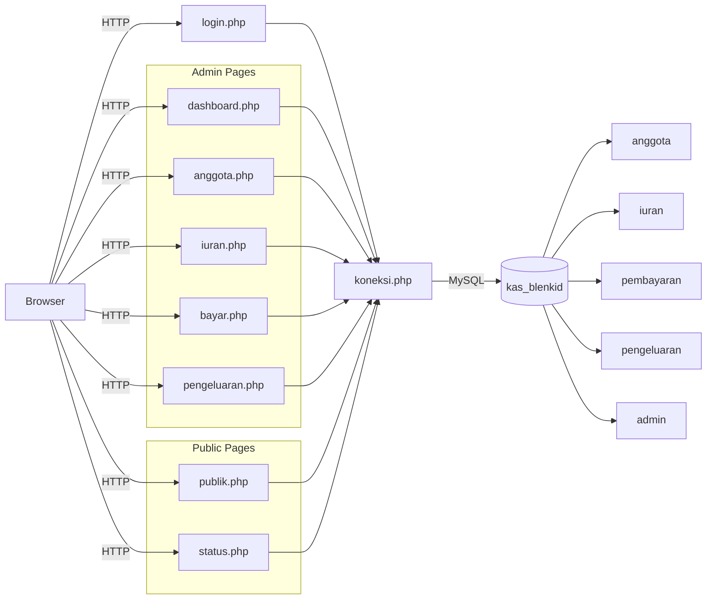
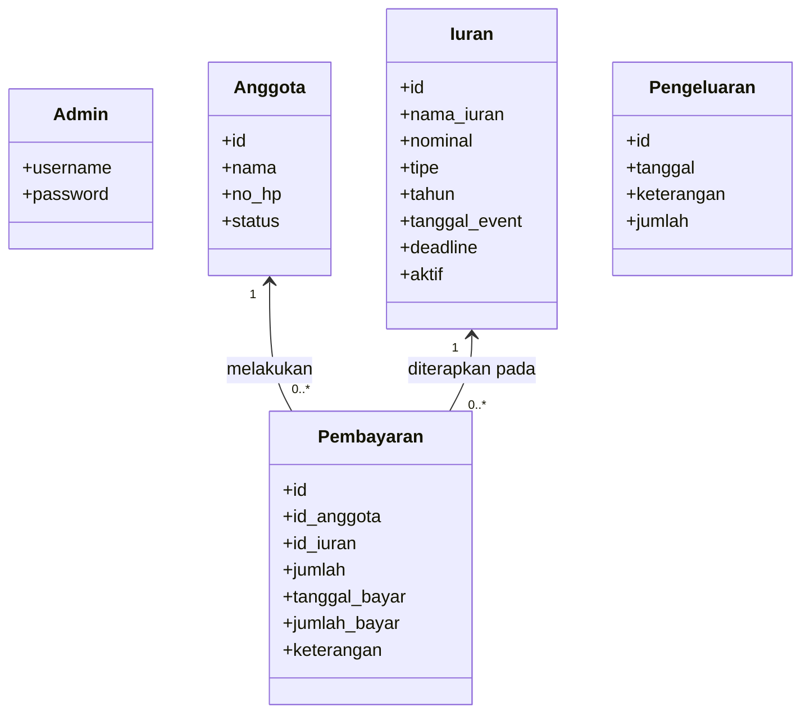
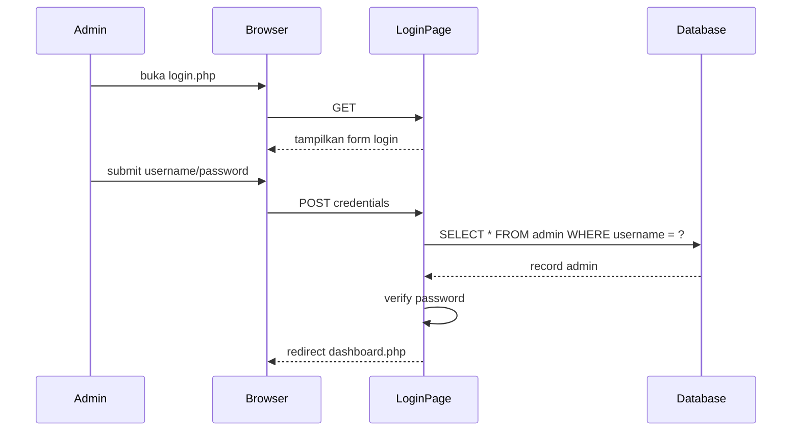
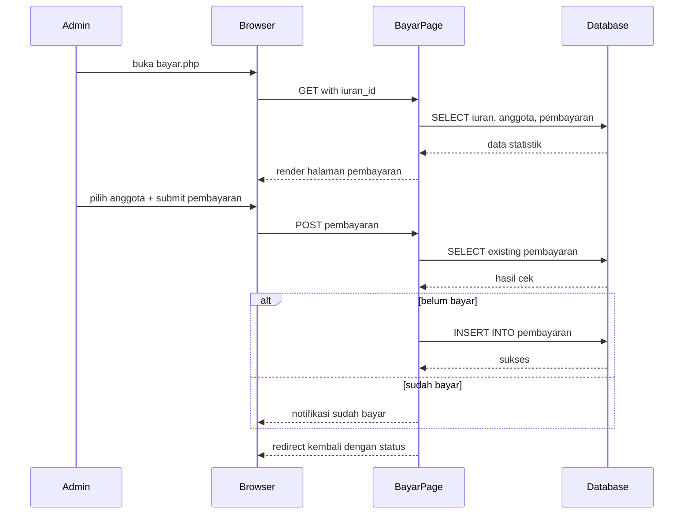

Nama: Akmaludin Ikhlasul Amal
NIM: 101230098

# Kas IPP BLENKID

Aplikasi kas sederhana untuk manajemen iuran, pembayaran, dan pengeluaran organisasi.

## Ringkasan
- Backend: PHP
- Database: MySQL / MariaDB
- Frontend: HTML, Bootstrap 5, CSS custom, JavaScript ringan
- Autentikasi: session PHP
- Struktur: halaman PHP terpisah untuk setiap fitur

## Perbaikan yang telah diterapkan
- `config.php` untuk konfigurasi pusat
- `functions.php` untuk helper sanitasi, auth, dan redirect
- Password admin sekarang mendukung hashing (`password_hash` / `password_verify`)
- Prepared statement ditambahkan untuk operasi CRUD utama
- Session guard admin distandarisasi
- Input output disanitasi dengan `esc()` dan `sc()`

## Use Case Diagram
```mermaid
usecaseDiagram
    actor Admin
    actor "Pengguna Publik" as Public

    Admin --> (Login)
    Admin --> (Lihat Dashboard)
    Admin --> (Kelola Anggota)
    Admin --> (Kelola Iuran)
    Admin --> (Catat Pembayaran)
    Admin --> (Lihat Anggota Belum Bayar)
    Admin --> (Catat Pengeluaran)
    Admin --> (Logout)

    Public --> (Lihat Transparansi Kas)
    Public --> (Cek Status Pembayaran)
    Public --> (Hubungi Admin via WhatsApp)
```

## Component Diagram


## Entity Diagram


## Sequence Diagram: Login Admin


## Sequence Diagram: Catat Pembayaran

